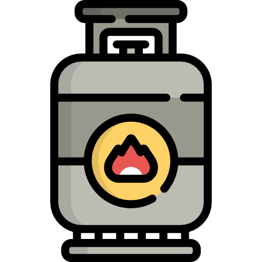
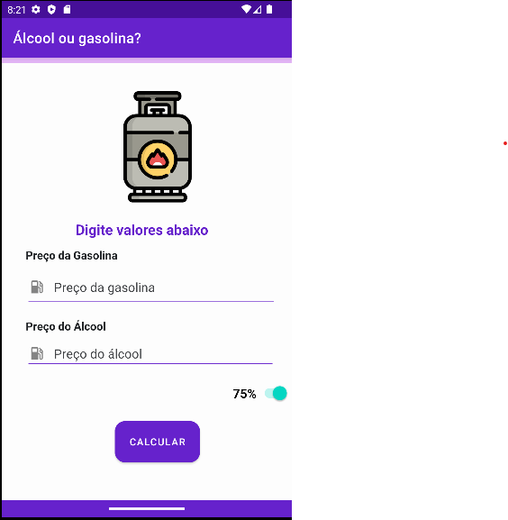
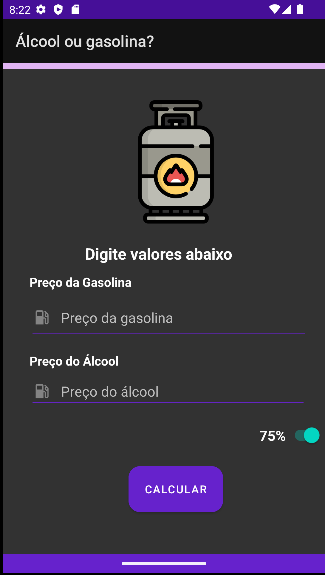
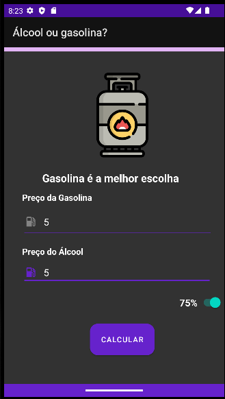
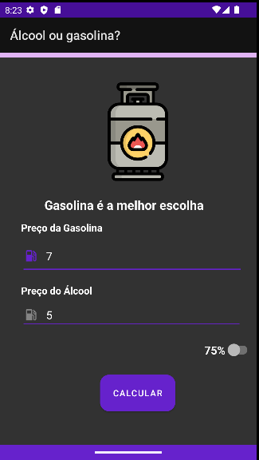

# Atividade Alcool ou Gasolina

*Aluno:* Lucas Levi Arry

## Cálculo

O código cria duas variáveis globais percentual e isSwitchChecked
que controle o valor do percentual que o usuário pode escolher para a conversão. os percentuais são 0.7 e 0.75.

```kotlin
// váriaveis globais
private var percentual:Double = 0.7

private lateinit var btCalc : Button
private lateinit var gasEdtTxt : EditText
private lateinit var alcEdtTxt : EditText
private lateinit var resTxt : TextView
private lateinit var swPercent : Switch
```

```kotlin
override fun onCreate(savedInstanceState: Bundle?) {
    super.onCreate(savedInstanceState)
    setContentView(R.layout.activity_main)
    Log.d("PDM23","No onCreate, $percentual")

    btCalc = findViewById(R.id.btCalcular)
    gasEdtTxt = findViewById(R.id.edGasolina)
    alcEdtTxt = findViewById(R.id.edAlcool)
    resTxt = findViewById(R.id.result)
    swPercent= findViewById(R.id.swPercentual)

    btCalc.setOnClickListener(OnClickListener {
        if (gasEdtTxt.text.isNotEmpty() and alcEdtTxt.text.isNotEmpty()) {
            var gasPrice: Double = gasEdtTxt.text.toString().toDouble()
            var etanolPrice: Double = alcEdtTxt.text.toString().toDouble()
            if(etanolPrice <= percentual*gasPrice) {
                resTxt.setText("Álcool é a melhor escolha")
            } else {
                resTxt.setText("Gasolina é a melhor escolha")
            }
        } else {
            resTxt.setText("Insira valores válidos")
        }
    })

    swPercent.setOnCheckedChangeListener { compoundButton, isChecked ->
        percentual = if (!isChecked) {
            0.7
        } else {
            0.75
        }
    }
}
```

---

## Ícone e layout

### Ícone

ícone escolhido




### Tema escuro

Tema claro e escuro




---

## Android SharedPreferences

O SharedPreferences é uma maneira de armazenar pares chave-valor de forma persistente em um aplicativo Android. Ele é frequentemente usado para armazenar configurações de aplicativos ou outros dados que precisam ser mantidos entre sessões de aplicativos.

```kotlin
// váriaveis globais
private var isSwitchChecked: Boolean = false
private lateinit var sharedPreferences : SharedPreferences
```

```kotlin
override fun onCreate(savedInstanceState: Bundle?) {
    sharedPreferences = getSharedPreferences("MyPrefs", Context.MODE_PRIVATE)
    percentual = sharedPreferences.getFloat("percentual", 0.7F).toDouble()
    isSwitchChecked = sharedPreferences.getBoolean("switchChecked", false)

    // Restante do código...
    swPercent.isChecked = isSwitchChecked
    
    // Restante do código...
    
    swPercent.setOnCheckedChangeListener { compoundButton, isChecked ->
        percentual = if (!isChecked) {
            0.7
        } else {
            0.75
        }
        isSwitchChecked = isChecked

        sharedPreferences.edit()
            .putFloat("percentual", percentual.toFloat())
            .putBoolean("switchChecked", isSwitchChecked)
            .apply()
    }
}
```

## Resultados



